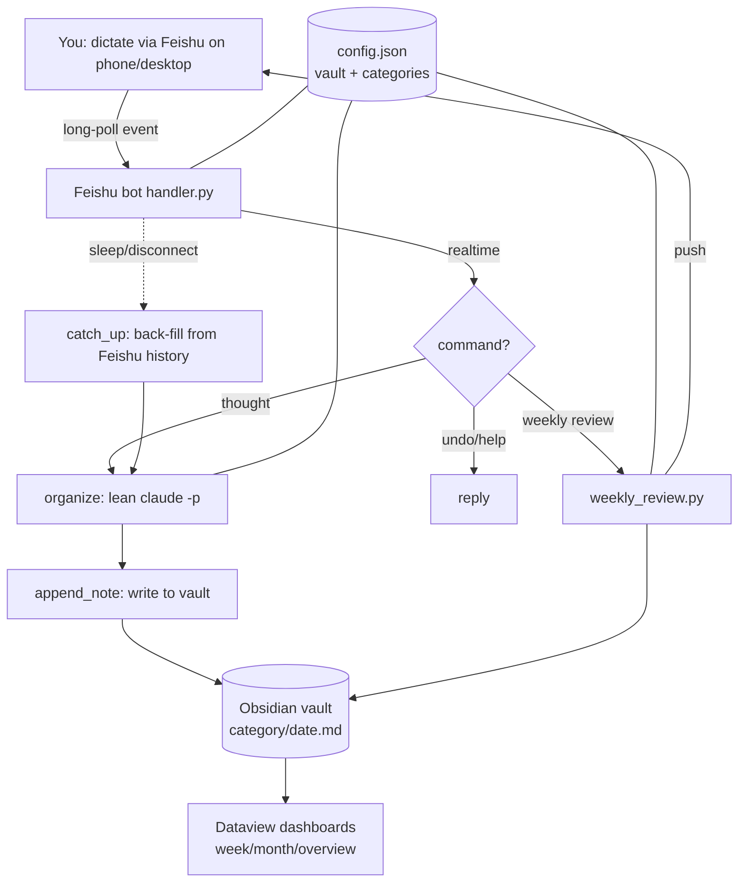

<!-- Language: English | [中文](README.md) -->

# journal-organizer

> Speak your mind — it cleans up your words **following your own train of thought**, auto-categorizes, and files them away; every week it even writes you a coherent reflection essay.
> An AI Skill that turns fleeting thoughts into a reviewable second brain.

`journal-organizer` is a [Claude Code / Agent Skill](https://docs.claude.com/en/docs/claude-code) bundled with a **Feishu/Lark bot frontend** and a set of **Obsidian dashboards**. You dictate or type your thoughts whenever they strike; it organizes them into clear prose that preserves *your* original order → auto-picks a category → files into your notes vault → writes a weekly review → and lets you look back by week/month via dashboards.

---

## Table of contents

- [What it can do](#what-it-can-do-capabilities)
- [Design philosophy](#design-philosophy)
- [Architecture & data flow](#architecture--data-flow)
- [How it's built (per module)](#how-its-built-per-module)
- [Key engineering decisions & gotchas](#key-engineering-decisions--gotchas)
- [Install & use](#install--use)
- [Configuration](#configuration)
- [File layout](#file-layout)
- [License](#license)

---

## What it can do (capabilities)

| Capability | Description |
|---|---|
| 🧠 **Organize in original order** | Turns rambling, jumpy, repetitive speech into clear text — **while preserving your train of thought and voice**. No restructuring, no concluding for you, no summarizing. This is what sets it apart from generic "AI summaries." |
| 🗂️ **Auto-categorize & file** | Picks the best-fit category from your own list and files into `vault/<category>/<date>.md`; same category + same day appends to one file, with timestamped blocks and the raw transcript folded away. |
| 🎙️ **Capture anytime via Feishu** | DM the bot (phone or desktop); it organizes, files, and replies instantly. |
| 😴 **Sleep-proof** | Messages sent while your computer sleeps stay in Feishu; on wake the bot back-fills them from history. |
| ↩️ **Commands** | Send "撤回" to delete the last entry, "帮助" for help, "周复盘" to generate a review on demand. |
| 📖 **Weekly review** | Every Sunday 21:00 it compiles the past week's entries into one coherent first-person reflection essay, saved to the vault and pushed to Feishu. |
| 📊 **Week/Month/Overview dashboards** | Dataview-powered: stat cards, colored category bars, per-week/day distribution, 8-week/6-month heatmaps; entries link back to the source. |
| 🔌 **Transport-agnostic** | The organizing "brain" is decoupled from the input — it can sit behind a chat, a bot, or a hotkey; it only needs raw text and config. |

---

## Design philosophy

Every decision follows a few principles — understanding them matters more than copying the code:

### 1. Faithful to the original order, not a summary
People dictate thoughts to *externalize their own thinking*, not to get a cold bullet-point digest. Reordering their logic or "concluding" for them throws away the very thing they wanted to keep. So the core task is strictly constrained: **make your words readable, don't rewrite them into the AI's words** — strip filler, fix punctuation, segment along how you actually moved between ideas, keep it sounding like you.

### 2. Brain decoupled from transport
"Organize + categorize + file format" is the core brain (`SKILL.md` + `file_note.py`); the Feishu bot is just one of many possible inputs. Both share one config, so the same logic can sit behind any frontend.

### 3. Config-driven, zero hardcoding
Vault path and categories all come from `~/.config/journal-organizer/config.json`, read by both bot and dashboards. The dashboards go further — they **auto-discover categories** (any folder containing dated files), so newcomers need zero setup.

### 4. Never lose a single entry
The unforgivable failure for a capture tool is "I recorded it but it didn't save." So: a message is **marked done only after it's successfully filed**, failures retry (capped); sleep/disconnect are covered by history back-fill; dedup keys on `message_id`, shared by both the realtime and back-fill paths — never duplicated, never dropped.

---

## Architecture & data flow



The whole line: **capture → organize & file → weekly review → review via dashboards**, all around one config and one Obsidian vault.

---

## How it's built (per module)

### 1. The brain: `SKILL.md` + `scripts/file_note.py`
- `SKILL.md` defines the workflow in natural language: read config → take the raw text → decide how many entries → clean (preserve order) → title → categorize → file via the script → report. It explains the *why* so the model understands rather than rote-follows.
- `file_note.py` hardcodes the **deterministic** filing: merge same-day same-category, timestamped headings, folded raw-transcript callout, append (never overwrite). Body/transcript are passed via files to avoid shell-escaping multi-line text. Written once, correct forever — no format drift.

Output format:
```markdown
# 2026-06-12 · Ideas

## 22:37 · one-line title
the organized body…

> [!note]- Raw transcript
> the original transcription, line-prefixed…

---
```

### 2. Feishu bot: `feishu-bot/templates/handler.py`
- **Receive**: `lark-cli event consume im.message.receive_v1` over a **long-lived WebSocket** — no public endpoint needed.
- **Organize**: calls `claude -p`, reusing your existing Claude subscription (**no separate API key cost**). Lean flags (see gotchas) cut startup from ~60s to a few seconds.
- **File**: the prompt's category list is generated from config; output is written to the vault (same format as the skill).
- **Back-fill**: a background thread every 180s + on startup uses `+chat-messages-list` to fetch recent messages, dedup by `message_id`, recovering anything missed during sleep/disconnect.
- **Commands**: undo (delete last), help, weekly review.
- **Resident**: a launchd service, auto-start + crash auto-restart (`KeepAlive`); stop via `bootout`.

### 3. Weekly review: `feishu-bot/templates/weekly_review.py`
Collects the **bodies** of the past week's (Mon–Sun) entries across categories, feeds them to `claude -p` with a carefully designed prompt to produce a first-person essay with through-lines, noting your changes and contradictions and a forward-looking nudge; saved to `vault/周复盘/` and pushed to Feishu via `--markdown`. Triggered by launchd every Sunday 21:00, or on demand by sending "周复盘".

### 4. Dashboards: `dashboards/*.md` (DataviewJS)
- Uses **DataviewJS** + Obsidian's `metadataCache.getFileCache(file).headings` to extract each day file's `## time · title` entries (Dataview's native page API doesn't expose headings, hence metadataCache).
- **Auto-discovers categories**: any folder containing `YYYY-MM-DD.md` files is a category; colors are assigned from a palette by alphabetical order — zero config, theme-aware.
- Renders stat cards, colored bars, and heatmaps with inline HTML + CSS variables; entries use `app.workspace.openLinkText` to jump back to the source.

---

## Key engineering decisions & gotchas

These are why the project is actually robust — and the easiest details to miss:

- **`claude -p` slow startup → long inputs time out and get lost**: by default each call loads a pile of MCP servers and skills; even "ok" took ~60s. Adding `--strict-mcp-config --mcp-config '{"mcpServers":{}}' --setting-sources ''` brings it down to a few seconds.
- **Mark-done only on success, then retry**: an early bug marked messages done up front, so a failed organize lost them forever. Now it `finish()`es only after a successful file, retrying failures up to a cap.
- **stdin treated as EOF in background**: `event consume` exits when stdin closes, so backgrounding/service-izing made it quit instantly. Feed it a never-closing stdin via `< <(tail -f /dev/null)`.
- **Bypass proxy for domestic services**: Feishu's long connection breaks behind a local proxy, so `LARK_CLI_NO_PROXY=1` forces a direct connection.
- **Back-fill never floods history**: it's bounded to the last N days + `message_id` dedup, so a lost dedup state can't re-import ancient messages.
- **Drop too-short inputs**: things like `"1"` or `"ok"` aren't treated as thoughts — skipped to avoid junk notes.

---

## Install & use

### A. As a Claude Skill (the brain)
Drop this repo into your skills dir (Claude Code: `~/.claude/skills/journal-organizer/`). On first trigger it guides you to configure the vault and categories. Then just say "record this thought…" or "let's review today."

### B. Feishu bot (anytime phone capture, optional, macOS)
> Each person creates their own Feishu app and authorizes `lark-cli`; credentials aren't shareable. See [`feishu-bot/README.md`](feishu-bot/README.md).
1. Install deps: Node.js, `npm i -g @larksuite/cli`, Claude Code.
2. Create a Feishu custom app → enable the bot → `lark-cli auth login`.
3. Run `bash feishu-bot/install.sh` (deploys scripts + auto-start + weekly-review timer).
4. Edit `~/.config/journal-organizer/config.json` with your vault path and categories.
5. In the Feishu console, enable long-connection event subscription `im.message.receive_v1` + permissions, then publish.

### C. Dashboards (optional)
Copy the notes in `dashboards/` into your Obsidian vault, install the **Dataview** plugin, and enable **Enable JavaScript Queries**. See [`dashboards/说明.md`](dashboards/说明.md).

---

## Configuration

`~/.config/journal-organizer/config.json` (shared by bot and skill):

```json
{
  "vault": "/absolute/path/to/your/vault",
  "categories": [
    {"name": "Daily log", "desc": "what happened today, what I did"},
    {"name": "Feelings", "desc": "mood, emotional swings, inner state"},
    {"name": "Learning review", "desc": "what I learned, summaries"},
    {"name": "Ideas", "desc": "content topics, writing/video ideas"}
  ]
}
```

`name` is the folder name; `desc` is the categorization basis. Presets in [`references/default-categories.md`](references/default-categories.md).

---

## File layout

```
journal-organizer/
├── SKILL.md                      # The brain: workflow + philosophy
├── scripts/file_note.py          # Deterministic filing script
├── references/default-categories.md  # Category presets (diary/review/ideas)
├── feishu-bot/                   # Feishu frontend (capture + weekly review)
│   ├── install.sh                # One-click installer (deploy/autostart/timer)
│   ├── README.md                 # Feishu console setup + troubleshooting
│   └── templates/
│       ├── handler.py            # receive→organize→file→back-fill→commands
│       ├── weekly_review.py      # weekly review generation + push
│       └── ctl.sh                # service control (status/start/stop/restart/log)
└── dashboards/                   # Obsidian dashboards (DataviewJS)
    ├── 本周看板.md / 本月看板.md / 总览看板.md
    └── 说明.md
```

---

## License

[MIT](LICENSE)

---

> Built with [Claude Code](https://claude.com/claude-code). If it helps you keep the sparks you used to lose, a Star ⭐ is appreciated.
