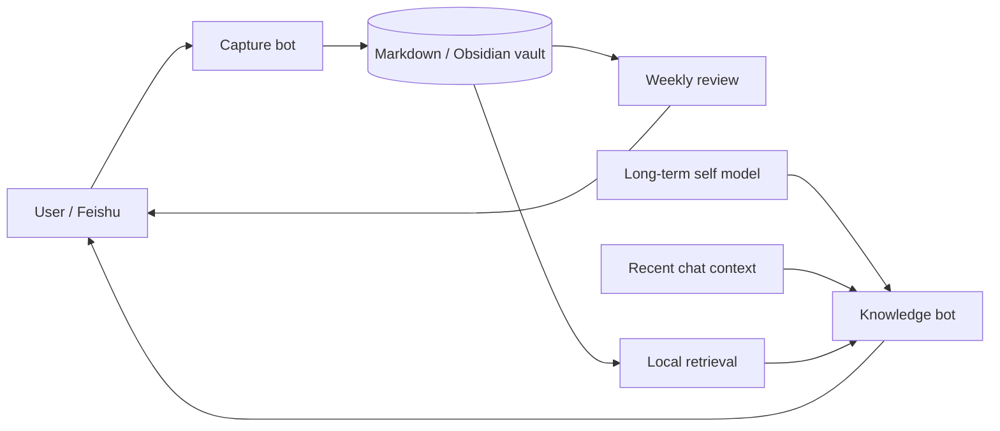

<!-- Language: [中文](README.md) | English -->

# Journal Organizer

> Turn quick Feishu messages into a personal knowledge system that keeps learning how you think.

Journal Organizer is a local-first personal AI system built around a Markdown or Obsidian vault. One Feishu bot faithfully captures and files thoughts; a second, read-only bot retrieves the vault and answers with a configurable long-term self model and recent conversation context.

## What it includes

| Component | Purpose |
|---|---|
| Capture bot | Cleans speech-like text without reordering the user's reasoning, classifies it, and appends it to Markdown |
| Reliable catch-up | Recovers messages sent while the Mac was asleep or disconnected and deduplicates by message ID |
| Weekly review | Produces a first-person weekly reflection from primary journal entries |
| Knowledge bot | Retrieves relevant notes and answers without editing the vault |
| Source hierarchy | Treats raw entries as primary evidence and AI weekly reviews as secondary trend material |
| Personal model | Keeps stable identity, goals, decision rules, and preferred conversational style in a private local file |
| Dashboards | Provides weekly, monthly, and overview pages through Obsidian DataviewJS |

## Architecture



Writing and answering are intentionally separated. The capture bot needs faithful, deterministic behavior; the knowledge bot needs retrieval and inference but stays read-only. Each bot uses a different Feishu app and `lark-cli` profile so their event consumers do not compete.

## Requirements

- macOS, Python 3, Node.js
- [`lark-cli`](https://github.com/larksuite/lark-cli)
- Codex CLI (included with the Codex desktop app or installed separately)
- Obsidian is optional; the vault is just Markdown

## Quick start

Create two Feishu custom apps, enable bots, use long-connection event delivery, subscribe to `im.message.receive_v1`, grant receive/send message permissions, publish both apps, and save them as two different `lark-cli` profiles.

Configure the vault:

```bash
mkdir -p ~/.config/journal-organizer
cp config.example.json ~/.config/journal-organizer/config.json
```

Edit the absolute `vault` path and categories, then install both bots:

```bash
JOURNAL_LARK_PROFILE=cli_writer \
KNOWLEDGE_LARK_PROFILE=cli_reader \
bash install-all.sh
```

Customize the private long-term model at:

```text
~/.knowledge-bot/self_model.md
```

## Retrieval behavior

The knowledge bot splits Markdown by second-level headings, matches English tokens and Chinese bi/tri-grams, boosts configured categories and recent notes, and selects only the most relevant chunks before calling Codex. Weekly reviews receive a default penalty because they are AI-generated; they are boosted only for growth, change, review, and timeline questions.

The default answer is conversational rather than citation-heavy. The bot distinguishes source facts, user opinions, and inference, and does not fabricate personal experiences.

## Reliability and privacy

- Messages are marked processed only after successful filing.
- Live events and history catch-up share the same message-ID deduplication state.
- The capture bot writes an append-only weekly index, with tombstones for undo events.
- The knowledge bot opens the vault read-only and runs Codex in a read-only sandbox.
- Credentials, personal notes, chat history, indexes, logs, and the real self model are excluded from Git.

See [docs/PROJECT.md](docs/PROJECT.md) for the full design history, [feishu-bot/README.md](feishu-bot/README.md) for capture setup, and [knowledge-bot/README.md](knowledge-bot/README.md) for retrieval configuration.

## License

[MIT](LICENSE)
