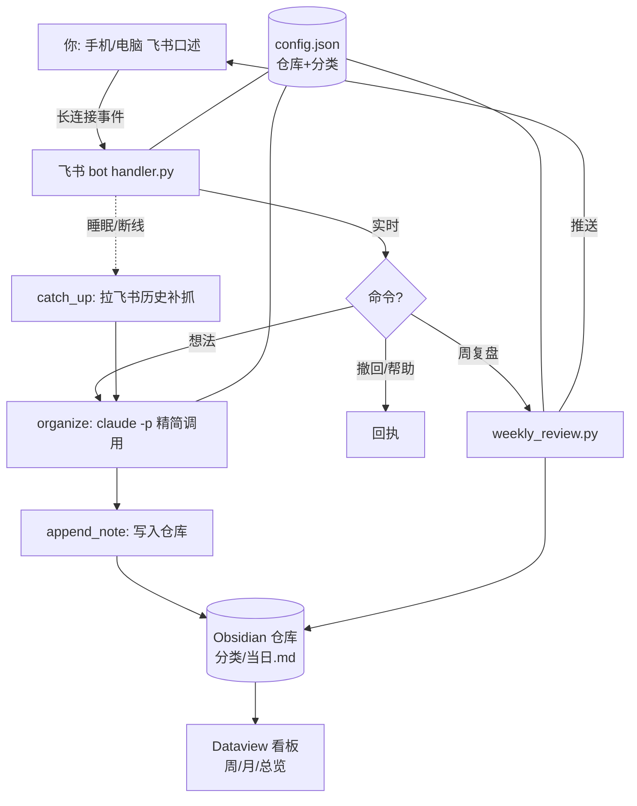

<!-- 语言: 中文 | [English](README.en.md) -->

# journal-organizer

> 说一段，它按你**原本的思路**整理成文、自动分类归档；每周还给你写一篇连贯的复盘文章。
> 一个把"随时冒出来的念头"变成可回看、可复盘的第二大脑的 AI Skill。

`journal-organizer` 是一个 [Claude Code / Agent Skill](https://docs.claude.com/en/docs/claude-code)，配套一个**飞书机器人前端**和一套 **Obsidian 看板**。你随手口述/打字记录所思所想，它负责：按你说话的原始顺序整理成清晰文字 → 自动判定分类 → 归档进你的笔记仓库 → 每周自动写复盘 → 用看板按周/月回看。

---

## 目录

- [它能做什么](#它能做什么能力)
- [设计理念（思路）](#设计理念思路)
- [架构与数据流](#架构与数据流)
- [实现方法（逐模块）](#实现方法逐模块)
- [关键工程决策与踩过的坑](#关键工程决策与踩过的坑)
- [安装与使用](#安装与使用)
- [配置](#配置)
- [文件清单](#文件清单)
- [License](#license)

---

## 它能做什么（能力）

| 能力 | 说明 |
|---|---|
| 🧠 **按原始语序整理** | 把口语化、跳跃、重复的口述，整理成清晰文字——但**保留你思考的原始顺序和口吻**，不重排、不替你下结论、不做总结升华。这是它区别于普通"AI 总结"的灵魂。 |
| 🗂️ **自动分类归档** | 从你自定义的分类里选最贴合的一个，归档进 `仓库/<分类>/<当日>.md`，同分类同一天追加进同一文件，时间戳分块、原文折叠保存。 |
| 🎙️ **飞书随时捕捉** | 在飞书私聊机器人发文字（手机/电脑皆可），即时整理归档并回执。 |
| 😴 **设备睡眠不丢** | 电脑睡着时发的消息留在飞书不丢，唤醒后自动从历史补抓补归档。 |
| ↩️ **命令** | 发「撤回」删最近一条；发「帮助」看用法；发「周复盘」即时生成复盘。 |
| 📖 **每周复盘** | 每周日 21:00 自动把过去一周的条目，写成一篇连贯的第一人称复盘文章，存进仓库并推送到飞书。 |
| 📊 **周/月/总览看板** | 基于 Dataview 的可视化：统计卡片、彩色分类分布、按周/日分布、近 8 周/6 月热力趋势，条目可点击跳回原文。 |
| 🔌 **传输无关** | 整理"大脑"与输入入口解耦——可坐在聊天、飞书 bot、快捷键背后，只要喂给它原始文本和配置。 |

---

## 设计理念（思路）

这个项目的每个设计都围绕几条原则，理解它们比照抄代码更重要：

### 1. 忠于原始语序，而不是总结
人对着设备口述想法，是为了**外化自己的思维流**，不是为了拿到一份冷冰冰的要点摘要。如果把人的逻辑重排、把后面说的提到前面、替他"得出结论"，就丢掉了他真正想留下的东西。所以核心任务被严格约束为：**让你的话变得可读，而不是改写成 AI 的话**——去口水词、修标点、顺着原话分段，读起来仍像你本人在说。

### 2. 大脑与传输分离（transport-agnostic）
"整理 + 分类 + 归档格式"是核心大脑（`SKILL.md` + `file_note.py`）；飞书机器人只是众多入口之一。两者共用同一份配置，大脑只需要"原始文本 + 配置"，因此同一套逻辑可以坐在聊天框、飞书 bot、快捷键背后。

### 3. 配置驱动、零硬编码
仓库路径和分类**全部来自配置** `~/.config/journal-organizer/config.json`，机器人和看板都读它。换仓库、改分类只动一处；看板更进一步——**自动发现分类**（扫描含日期文件的文件夹），新人零配置即用。

### 4. 一条都不能丢（可靠性优先）
记录工具最不可原谅的是"我明明记了却没存上"。所以：消息**成功归档后才标记已处理**，失败自动重试（上限封顶）；睡眠/断线靠飞书历史补抓兜底；去重以 `message_id` 为准，实时与补抓两条路共用，绝不重复也绝不遗漏。

---

## 架构与数据流



整条线：**口述捕捉 → 整理归档 → 每周复盘 → 看板回看**，全部围绕同一份配置和同一个 Obsidian 仓库。

---

## 实现方法（逐模块）

### 1. 整理大脑：`SKILL.md` + `scripts/file_note.py`
- `SKILL.md` 用自然语言定义工作流：读配置 → 取原文 → 判断拆几条 → 清洗（保留原序）→ 起标题 → 判分类 → 调脚本归档 → 汇报。把"为什么"讲清楚，让模型理解而非死记。
- `file_note.py` 把**确定性**的归档动作固化成脚本：当日同分类合并、时间戳小标题、原文折叠 callout、追加而非覆盖。正文/原文用文件传入，规避命令行多行转义。写一次写对，省得每次重造、避免格式漂移或覆盖已有内容。

归档格式：
```markdown
# 2026-06-12 · 创作灵感

## 22:37 · 一句话小标题
整理后的正文……

> [!note]- 原始记录
> 逐行加引用前缀的原始转录……

---
```

### 2. 飞书机器人：`feishu-bot/templates/handler.py`
- **接收**：`lark-cli event consume im.message.receive_v1` 以**长连接（WebSocket）**方式收私聊消息——无需公网地址。
- **整理**：调用 `claude -p`，复用你已有的 Claude 订阅（**不另花 API key 的钱**）。关键加了精简 flag（见下方踩坑），把每次启动从 ~60s 砍到几秒。
- **归档**：分类由配置动态生成 prompt，整理后写入仓库（与 skill 同格式）。
- **补抓**：后台线程每 180 秒 + 启动时，用 `+chat-messages-list` 拉最近消息，靠 `message_id` 去重，把睡眠/断线期间漏掉的补回来。
- **命令**：撤回（删最近一条）、帮助、周复盘。
- **常驻**：launchd 服务，开机自启 + 崩溃自愈（`KeepAlive`），停止须用 `bootout`。

### 3. 每周复盘：`feishu-bot/templates/weekly_review.py`
抓取过去一周（周一~周日）各分类条目的**正文**，拼成材料喂给 `claude -p`，按精心设计的 prompt 写成一篇第一人称、有主线、点出变化与矛盾、给下周提醒的连贯文章；存进 `仓库/周复盘/` 并用 `--markdown` 推送到飞书。两种触发：launchd 每周日 21:00 自动；或飞书发「周复盘」即时生成。

### 4. 看板：`dashboards/*.md`（DataviewJS）
- 用 **DataviewJS** + Obsidian `metadataCache.getFileCache(file).headings` 把每个日文件里的 `## 时间 · 标题` 抠出来（Dataview 原生 page API 不暴露标题，故走 metadataCache）。
- **自动发现分类**：凡是"含 `YYYY-MM-DD.md` 文件"的文件夹即为一个分类，颜色按字母序从调色板分配——零配置、跟随主题。
- 用内联 HTML + CSS 变量渲染统计卡片、彩色条形、热力表；条目用 `app.workspace.openLinkText` 点击跳回原文。

---

## 关键工程决策与踩过的坑

这些是项目真正"耐用"的原因，也是最容易被忽略的细节：

- **`claude -p` 启动慢 → 长输入超时丢消息**：默认每次调用会加载一堆 MCP server 和 skill，一句"收到"都要 ~60s。加 `--strict-mcp-config --mcp-config '{"mcpServers":{}}' --setting-sources ''` 后降到几秒，长文本不再超时。
- **成功才标记、失败重试**：早期"开头就标记已处理"导致整理失败的消息永久丢失。改为**成功归档后才 finish()**，失败累计重试、超上限才放弃。
- **后台运行 stdin 被当 EOF**：`event consume` 把 stdin 关闭当退出信号，后台/服务化会秒退。用 `< <(tail -f /dev/null)` 喂一个永不关闭的 stdin。
- **国内服务绕代理**：飞书走本地代理时长连接易被打断，统一 `LARK_CLI_NO_PROXY=1` 直连。
- **补抓不回灌历史**：补抓限定"最近 N 天 + message_id 去重"，避免去重状态丢失时把陈年消息重新灌进来。
- **太短输入拦截**：`"1"`、`"嗯"` 这类不当作想法，直接跳过，避免垃圾笔记。

---

## 安装与使用

### A. 作为 Claude Skill（整理大脑）
把本仓库放进你的 skills 目录（Claude Code：`~/.claude/skills/journal-organizer/`），首次触发时它会引导你配置仓库路径和分类。之后对它说「记录一下我刚想的…」「复盘下今天」即可。

### B. 飞书机器人（手机随时捕捉，可选，macOS）
> 每个人需自建飞书应用并授权 `lark-cli`，凭证不可共享。详见 [`feishu-bot/README.md`](feishu-bot/README.md)。
1. 装依赖：Node.js、`npm i -g @larksuite/cli`、Claude Code。
2. 建飞书自建应用 → 启用机器人 → `lark-cli auth login`。
3. 跑 `bash feishu-bot/install.sh`（自动部署脚本 + 开机自启 + 每周复盘定时）。
4. 编辑 `~/.config/journal-organizer/config.json` 填仓库路径和分类。
5. 飞书后台开启长连接事件订阅 `im.message.receive_v1` + 相应权限并发布。

### C. 看板（可选）
把 `dashboards/` 里的笔记复制进你的 Obsidian 仓库，安装 **Dataview** 插件并开启 **Enable JavaScript Queries**。详见 [`dashboards/说明.md`](dashboards/说明.md)。

---

## 配置

`~/.config/journal-organizer/config.json`（飞书 bot 与 skill 共用）：

```json
{
  "vault": "/绝对路径/你的/笔记仓库",
  "categories": [
    {"name": "生活记录", "desc": "这一天发生了什么、做了什么"},
    {"name": "情绪感受", "desc": "当下心情、情绪波动、内心状态"},
    {"name": "学习复盘", "desc": "学到的知识、对某主题的总结"},
    {"name": "创作灵感", "desc": "内容选题、写作/视频的点子"}
  ]
}
```

`name` 即文件夹名；`desc` 是归类依据。分类预设见 [`references/default-categories.md`](references/default-categories.md)。

---

## 文件清单

```
journal-organizer/
├── SKILL.md                      # 整理大脑：工作流 + 理念
├── scripts/file_note.py          # 确定性归档脚本
├── references/default-categories.md  # 分类预设（日记/复盘/灵感三套）
├── feishu-bot/                   # 飞书前端（手机捕捉 + 每周复盘）
│   ├── install.sh                # 一键安装器（部署/自启/定时）
│   ├── README.md                 # 飞书后台配置 + 排错
│   └── templates/
│       ├── handler.py            # 收消息→整理→归档→补抓→命令
│       ├── weekly_review.py      # 每周复盘生成 + 推送
│       └── ctl.sh                # 服务管理（status/start/stop/restart/log）
└── dashboards/                   # Obsidian 看板（DataviewJS）
    ├── 本周看板.md / 本月看板.md / 总览看板.md
    └── 说明.md
```

---

## License

[MIT](LICENSE)

---

> 用 [Claude Code](https://claude.com/claude-code) 构建。如果它也帮你留住了那些平时流失的灵光一闪，欢迎 Star ⭐
