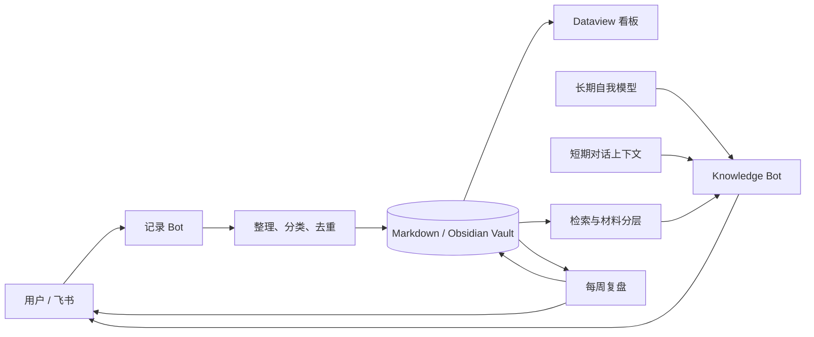

<!-- 语言: 中文 | [English](README.en.md) -->

# Journal Organizer

> 把飞书里的随手想法沉淀成一个会持续生长、能够理解你的个人知识系统。

Journal Organizer 是一套本地优先的个人 AI 系统：一个 Bot 负责忠实记录，一个 Bot 负责理解和回答。所有长期记忆都保存在你自己的 Markdown / Obsidian 仓库里，Codex 只在需要时整理或检索材料。

它最初只是一个“口述想法自动归档”Skill，后来逐步补上了消息补抓、周复盘、Obsidian 看板、知识检索、长期自我模型和短期对话记忆，最终形成一套完整的个人知识 Agent。

## 核心能力

| 模块 | 作用 |
|---|---|
| 记录 Bot | 接收飞书文字或富文本，保留原始思路整理、分类并写入 Obsidian |
| 消息补抓 | Mac 睡眠或网络断开后，从飞书历史补抓，按 `message_id` 去重 |
| 周复盘 | 每周日自动汇总一手记录，生成一篇第一人称成长复盘 |
| Knowledge Bot | 只读检索知识库，结合长期自我模型和最近几轮对话回答 |
| 材料分层 | 原始记录是一手材料；AI 周复盘是二级材料，只在趋势问题中加权 |
| 分类优先检索 | 根据问题匹配分类、关键词、时间和标题，先找最可能相关的内容 |
| Obsidian 看板 | 自动统计周/月记录量、分类分布和时间趋势 |

## 为什么是两个 Bot

写入和回答是两种不同职责：

- 记录 Bot 必须忠实、克制、确定性强，不能把用户的话改成 AI 的观点。
- Knowledge Bot 需要检索、联想和推断，但必须保持只读，不能在回答时意外改写知识库。

两个飞书应用使用不同 `lark-cli profile`，因此可以同时运行，不会争抢同一条事件流。



## 知识检索逻辑

Knowledge Bot 不是把整个仓库塞给模型。它先在本地完成轻量检索：

1. 按 Markdown 二级标题拆成独立知识片段。
2. 用问题里的中英文词、中文二元/三元词组进行匹配。
3. 根据配置里的分类说明和关键词，提高相关分类权重。
4. 对近期材料增加少量权重。
5. 默认降低“周复盘”权重，因为它是 AI 生成的二级材料。
6. 当问题涉及变化、成长或时间线时，再提高周复盘权重。
7. 把筛出的材料、长期自我模型和最近对话交给 Codex 生成回答。

默认回复不会机械列出来源。材料的作用是帮助 Agent 形成上下文，而不是把聊天写成检索报告。需要审计时，日志仍会记录检索数量和来源类型。

## 快速开始

### 1. 准备依赖

- macOS（后台服务使用 `launchd`）
- Python 3
- Node.js
- [`lark-cli`](https://github.com/larksuite/lark-cli)：`npm install -g @larksuite/cli`
- Codex CLI（Codex 桌面版已内置，或自行安装）
- Obsidian 可选；知识库本质上只是 Markdown 文件夹

### 2. 创建两个飞书应用

在飞书开放平台创建两个自建应用，分别启用机器人：

- Journal / Capture：记录和周复盘
- Knowledge：知识库问答

两个应用都需要：

1. 选择“使用长连接接收事件”。
2. 订阅 `im.message.receive_v1`。
3. 开启接收私聊和发送消息相关权限。
4. 创建版本并发布。
5. 分别保存为两个 `lark-cli profile`。

### 3. 配置知识库

```bash
mkdir -p ~/.config/journal-organizer
cp config.example.json ~/.config/journal-organizer/config.json
```

编辑 `config.json`，至少设置：

- `vault`：Markdown 知识库的绝对路径
- `categories`：记录 Bot 可选择的分类及描述
- `knowledge.category_keywords`：问题到分类的额外路由词，可选

### 4. 安装两个 Bot

```bash
JOURNAL_LARK_PROFILE=cli_writer \
KNOWLEDGE_LARK_PROFILE=cli_reader \
bash install-all.sh
```

也可以单独安装：

```bash
LARK_PROFILE=cli_writer bash feishu-bot/install.sh
LARK_PROFILE=cli_reader bash knowledge-bot/install.sh
```

安装后编辑私有长期模型：

```text
~/.knowledge-bot/self_model.md
```

模板会引导你写身份、当前目标、价值观、决策原则和偏好的说话方式。这个文件已被 `.gitignore` 排除，不会进入仓库。

## 日常使用

记录 Bot：

- 直接发一段想法：整理并归档
- `撤回`：删除最近一条归档
- `周复盘`：立即生成本周复盘
- `帮助`：查看命令

Knowledge Bot：

- 直接提问：基于知识库回答
- `重建索引`：生成本地 JSONL 索引，用作 Vault 暂时不可读时的回退
- `帮助`：查看说明

服务管理：

```bash
~/.journal-bot/ctl.sh status
~/.journal-bot/ctl.sh restart
~/.knowledge-bot/ctl.sh status
~/.knowledge-bot/ctl.sh restart
```

## 数据格式

同一分类、同一天的记录会追加到同一个文件：

```markdown
# 2026-07-22 · 信念与原则

## 21:10 · 重新理解主场

整理后的正文，保持原始思考顺序和第一人称口吻。

> [!note]- 原始记录
> 用户发送的原文会折叠保留。

---
```

## 可靠性设计

- 成功写入后才把消息标记为已处理。
- 实时消费与历史补抓共享 `message_id` 去重状态。
- 补抓只看最近数天，避免状态丢失后回灌全部历史。
- 归档时额外写入 append-only 周复盘索引，减少 macOS 对 Obsidian 目录权限波动造成的定时任务失败。
- 两个 Agent 各自使用独立飞书应用和独立 launchd 服务。
- Knowledge Bot 对 Vault 只读，Codex 运行在 `read-only` sandbox。

## 隐私边界

仓库只包含通用代码和示例，不包含：

- 飞书 App ID / Secret 或登录凭证
- 私人知识库正文
- 真实长期自我模型
- 聊天历史、消息 ID、索引和运行日志

这些数据只保存在本机的 `~/.journal-bot/`、`~/.knowledge-bot/` 和你的 Vault 中。请在公开 Fork 前再次运行敏感信息扫描。

## 项目结构

```text
journal-organizer/
├── SKILL.md                         # 记录整理 Skill
├── config.example.json              # Vault、分类、检索配置
├── install-all.sh                   # 双 Bot 安装入口
├── scripts/file_note.py             # 确定性 Markdown 归档
├── feishu-bot/                      # 写入 Bot + 周复盘
├── knowledge-bot/                   # 只读知识问答 Bot
├── dashboards/                      # Obsidian Dataview 看板
├── examples/vault/                  # 匿名示例知识库
├── tests/                            # 语法与核心检索测试
└── docs/PROJECT.md                  # 项目演进、设计决策与路线图
```

更完整的项目总结见 [docs/PROJECT.md](docs/PROJECT.md)，飞书配置细节见 [feishu-bot/README.md](feishu-bot/README.md) 和 [knowledge-bot/README.md](knowledge-bot/README.md)。

## License

[MIT](LICENSE)
